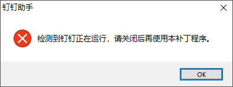
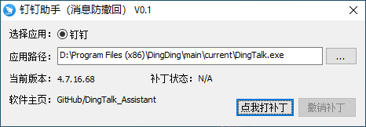
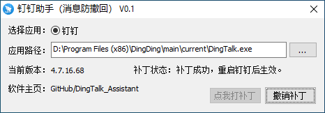

# 钉钉助手 - 防撤回、多开补丁

适用于 Windows 下 PC 版钉钉的消息防撤回、程序多开、屏蔽频繁更新补丁。

下载地址：None.

## 使用方法

1. 确认操作系统为 Windows XP - Windows 10 （32/64位皆可）。

2. 使用本程序前请先关闭钉钉进程，否则会弹出如下提示框并退出本程序。

    

3. **以管理员身份运行本程序**，正常情况下弹出如下程序界面。

    
    
    一般情况下，程序会自动获取钉钉安装路径；如果获取失败，请点击右边 "..." 按钮手动选取钉钉程序安装位置。

4. 单击 "点我打补丁" 按钮，不出意外的话，会显示 "补丁成功，重启钉钉后生效" 字样。
    
    

5. 如果想恢复原始钉钉功能，则只需点击 "撤销补丁" 按钮即可。

**PS. 因为本程序会修改钉钉的二进制文件，某些杀毒软件可能会报毒，请手动选择放行即可。本程序无毒无害，请放心食用**

## 源码编译

**下载源码**

```bash
mkdir DingTalk_Assistant

cd DingTalk_Assistant

git clone https://github.com/mohuihui/DingTalk_Assistant.git ./

```

**开始编译**

使用 Visual Studio 2005 或更高版本的 Visual Studio 打开 DingTalk_Assistant/src/AntiRecall.sln 工程，然后直接编译即可。

## 联系我

QQ：2059233565

邮箱：zhenfei.mzf@gmail.com

微博：https://weibo.com/minzhenfei

对 "钉钉助手" 有任何使用上或者技术上的疑问，欢迎随时联系作者。

## 开源协议

基于 [木兰宽松许可证](https://license.coscl.org.cn/MulanPSL/) 进行开源。

## 免责申明

本程序是作者闲暇之余，方便自己搞的一个小 trick 工具。如果对其他人/公司造成不好的影响，请邮件 zhenfei.mzf@gmail.com 联系作者，我会马上删除，谢谢。
